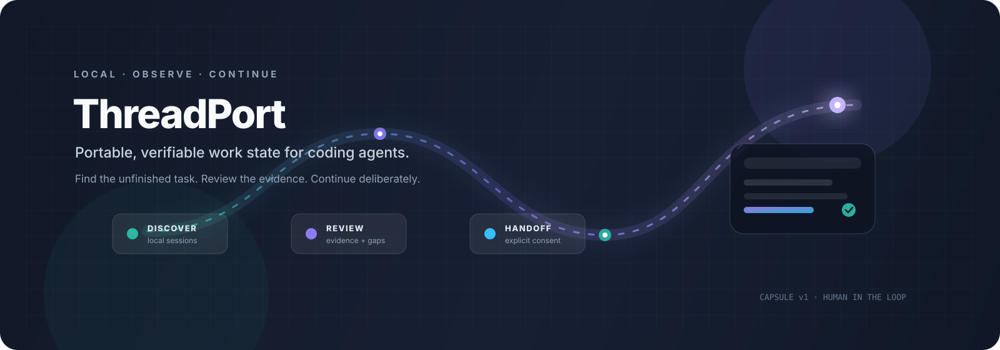
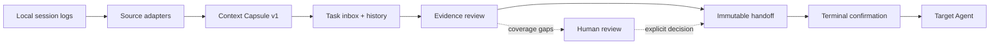

<p align="center">
  
</p>

<p align="center">
  <a href="https://github.com/Frankie-Xu/threadport/actions/workflows/ci.yml"></a>
  
  
  
  <a href="LICENSE"></a>
</p>

<h1 align="center">ThreadPort</h1>

<p align="center">
  <strong>Portable, verifiable work state for coding agents.</strong><br />
  Find unfinished AI coding tasks, review their evidence, and prepare a deliberate continuation with Claude or Codex — locally, explicitly, and with a human in the loop.
</p>

<p align="center">
  <a href="#quick-start">Quick start</a> ·
  <a href="#how-the-pieces-fit">How it works</a> ·
  <a href="#product-preview">Product preview</a> ·
  <a href="docs/v0.2/README.md">Documentation</a> ·
  <a href="CONTRIBUTING.md">Contributing</a>
</p>

> [!WARNING]
> ThreadPort `0.3.0-dev.0` is an experimental local workbench. Real Agent/platform certification, cross-agent authentication, and external user validation are still pending; stable release remains **HOLD**. See the [release boundary](docs/releases-v0.3.0-dev.0.md) and [release HOLD record](docs/verification/release-0.2.0.md).

## The idea

Coding-agent sessions often stop with useful context trapped in a terminal, an IDE, or a local log directory. ThreadPort turns the observable part of that work into a reviewable **Context Capsule**:

<table>
  <tr>
    <td width="25%"><strong>01 · Discover</strong><br /><sub>Find unfinished sessions and attach them to a task.</sub></td>
    <td width="25%"><strong>02 · Review</strong><br /><sub>Separate evidence, decisions, uncertainty, and current workspace state.</sub></td>
    <td width="25%"><strong>03 · Prepare</strong><br /><sub>Build a complete handoff for a compatible target Agent.</sub></td>
    <td width="25%"><strong>04 · Confirm</strong><br /><sub>Read the transfer text and confirm again in your terminal.</sub></td>
  </tr>
</table>

ThreadPort transfers observable work state — objectives, decisions, files, commands, tests, Git identity, evidence, and the next action. It does **not** transfer hidden chain-of-thought, silently run a logged command, upload session data, or treat an Agent's self-report as proof of completion.

## Product preview

The screenshots below use synthetic data from the local workbench. They show the review surfaces that are already implemented; synthetic demo data is never presented as real continuation evidence.

<table>
  <tr>
    <td width="50%" valign="top">
      
      <p align="center"><sub><strong>History</strong> — search sessions, messages, commands, and task context.</sub></p>
    </td>
    <td width="50%" valign="top">
      
      <p align="center"><sub><strong>Continuation preview</strong> — inspect the complete transfer text before copying the terminal command.</sub></p>
    </td>
  </tr>
</table>

## Why ThreadPort

| Concern | ThreadPort's answer |
| --- | --- |
| Context is scattered across tools | Normalize observable session traces into one portable Capsule v1 shape. |
| Historical output can look more certain than it is | Keep evidence, applicability, uncertainty, and coverage gaps explicit. |
| A handoff can become an accidental execution path | Prepare and preview first; require a fresh terminal confirmation before a target Agent starts. |
| Local logs can contain secrets or machine-specific paths | Redact before summaries and keep processing local by default. |
| “Found on PATH” is not the same as “safe to launch” | Target discovery reports candidates; it does not claim vendor identity, compatibility, or automatic launch support. |

## How the pieces fit



The [Capsule v1 schema](schema/capsule-v1.schema.json) is the stable boundary for portable work state. The local workbench adds task management, search, workspace snapshots, verification, and a controlled handoff envelope around it.

## Quick start

Requires Node `>=24.0.0` for this development checkout.

```bash
npm ci
npm run build
node dist/src/cli.js ui --no-open
```

Then:

1. Open the loopback URL printed in your terminal and choose an explicit workspace and source directory in **Settings**.
2. Refresh the source, find a session in **History**, and create or attach a task.
3. Review the observed evidence, confirm the objective and constraints, prepare a continuation, and read the complete transfer text.
4. Copy the fixed ThreadPort command. The terminal asks for `CONTINUE` again before launching a compatible installed Agent.

To explore the interface without local logs:

```bash
node dist/src/cli.js ui --demo --no-open
```

Demo mode uses isolated synthetic data. It does not count as real continuation evidence, and it does not require an account, API key, or telemetry opt-in.

## CLI and SDK

After `npm run build`, the artifact CLI can extract, validate, render, and package a handoff:

```bash
node dist/src/cli.js extract --from claude --session ./session.jsonl --project .
node dist/src/cli.js validate /path/printed/by/extract.json
node dist/src/cli.js render /path/printed/by/extract.json
node dist/src/cli.js handoff --to codex /path/to/capsule.json --format json --out ./handoff.json
node dist/src/cli.js validate --handoff ./handoff.json
node dist/src/cli.js targets
```

The public TypeScript adapters map observable traces onto Capsule v1. They never execute `next_action`, and they do not treat a session file as a published vendor schema:

```ts
import {
  createClaudeAdapter,
  createCodexAdapter,
  createCursorAdapter,
  createGeminiAdapter,
} from "threadport";

const capsule = await createGeminiAdapter().extract({
  sessionPath: "./tests/fixtures/gemini/session-basic.json",
  project: { name: "my-app", root: process.cwd() },
});
```

The `createClaudeAdapter`, `createCodexAdapter`, and `createCursorAdapter` functions accept the same input shape. Pass a local session file or already-read text.

## What is captured

| Capsule field | What it means |
| --- | --- |
| Objective | A candidate objective derived from the latest visible user message, awaiting confirmation. |
| Decisions and constraints | User-confirmed intent, review history, and unresolved conflicts. |
| Files, commands, and tests | Observable attempts and outcomes, kept chronological and scoped to their session and working directory. |
| Git state | HEAD, index, worktree, untracked contents, and a bounded dirty-diff hash. |
| Evidence | Redacted source events, snapshots, verification results, and explicit coverage limits. |
| Next action | A reviewable suggestion; never an instruction that ThreadPort executes automatically. |

### Adapters and evidence boundaries

- Claude and Codex sources can be indexed incrementally from explicitly configured roots. See [Claude source compatibility](compatibility/claude-source.md), [Codex format evidence](compatibility/codex-source.md), and [indexing and recovery](docs/v0.2/08-indexing.md).
- Cursor Copy Transcript import is intentionally transcript-only: structured tool results are absent, so the Capsule remains paused and does not claim files, commands, tests, or completion. See [Cursor evidence verification](docs/verification/cursor-native-evidence.md).
- Gemini and other structured inputs follow the same evidence rules: ambiguous or incomplete records remain unknown instead of being upgraded by inference.
- Native source adapters are observe-only. Real cross-agent authentication and continuation success remain unverified; the [compatibility matrix](docs/compatibility.md) is the source of truth.

### Privacy and local storage

- Processing is local-only. Source sessions and project contents are read locally; exported artifacts go to an explicit or temporary destination.
- Complete visible record strings and metadata pass a heuristic secret-redaction boundary before summaries are truncated. Redaction is not encryption or a guarantee that arbitrary encoded secrets are removed; inspect artifacts before sharing.
- Portable mode keeps nested repository paths relative and maps external paths to opaque `external/<hash>` locators. Use `--privacy local` only when retaining local paths is intentional.
- Workspace snapshots use a bounded read-only policy. Sensitive filenames are excluded before content reads, incomplete captures block preparation, and ignored path counts remain visible. See the [workspace reading policy](docs/adr/0012-workspace-reading-policy.md).

## Local workbench surfaces

The browser workbench is intentionally small and explicit:

- **Inbox** — create and edit manual tasks, attach source sessions, and resolve revision conflicts.
- **History** — search Chinese and English text, relative paths, task titles, projects, agents, and UTC date ranges with bounded snippets.
- **Task detail** — inspect evidence, reviewed decisions, control-plane receipts, workspace verification, and unresolved coverage gaps.
- **Continuation preview** — select a source session, target Agent, workspace, and mode; inspect the complete transfer text before confirming.
- **Settings and diagnostics** — configure sources, storage, retention, exports, and local server state.

The server exposes a protected loopback entry point through `startLocalServer({ dataDir? })` and an authenticated `GET /api/v1/status`. The `ui` command prints a fragment-token link once; refreshing requires reopening the current terminal link. Ctrl-C stops the service. See [local server documentation](docs/v0.2/13-local-server.md).

## Safety boundary

ThreadPort is a review and preparation tool. Consumers must validate the Capsule and ask for confirmation before modifying a repository. The `continue` command:

1. loads an immutable task handoff;
2. displays the complete context, target, and workspace;
3. requires an interactive terminal and the exact `CONTINUE` phrase;
4. verifies the workspace and launch plan again;
5. consumes the one-use handoff before inheriting the terminal.

Non-TTY use and `--yes` are rejected. A target's nonzero exit is recorded separately; a clean process exit does not mark the task complete. Receipt claims must match a prepared manifest, explicit target session/run, and independent evidence. Agent self-report alone remains `unknown`.

## Verification and development status

Run the local quality gates with:

```bash
npm run check
npm run check:pack
npm audit
```

`npm run check` covers formatting, TypeScript, the build, tests, documentation links, and redaction checks. `check:pack` installs the tarball into an isolated directory and checks the CLI, public exports, schemas, migrations, and native SQLite creation. The release notes record the current `0.3.0-dev.0` evidence and its remaining boundaries.

> [!NOTE]
> Passing local checks does not certify a real Claude/Codex continuation, cross-platform support, user activation, or a stable release. See the [control-plane review](docs/verification/control-plane-review-2026-09-22.md), [compatibility evidence](docs/compatibility-evidence.md), and [release HOLD record](docs/verification/release-0.2.0.md).

## Documentation map

| Start here | Go deeper |
| --- | --- |
| [v0.2 documentation index](docs/v0.2/README.md) | Product scope, architecture, contracts, quality gates, and release criteria. |
| [Local development](docs/LOCAL-DEVELOPMENT.md) | Workspace setup and the supported local development loop. |
| [Compatibility matrix](docs/compatibility.md) | Supported formats, versions, and explicit certification gaps. |
| [Release boundary](docs/releases-v0.3.0-dev.0.md) | What the Observe prerelease does and does not claim. |
| [Current verification records](docs/verification/) | Evidence for UI, indexing, lifecycle, runtime, and release gates. |
| [Security policy](SECURITY.md) | How to report a vulnerability privately. |
| [Contributing guide](CONTRIBUTING.md) | Branches, pull requests, tests, evidence, and rollback expectations. |

<details>
<summary><strong>Advanced implementation notes</strong></summary>

### Git fingerprints and handoff boundary

Snapshots distinguish HEAD-to-index, index-to-worktree, and untracked contents, including symlinks as links. They use a domain-separated hash algorithm; Capsules exported by an older incomplete algorithm must be re-extracted before comparing. Git output is capped at 32 MiB per command with a 30-second timeout, and aggregate untracked regular-file content is capped at 64 MiB. Snapshot consistency checks are best-effort; no repository lock or atomic filesystem snapshot is claimed.

`gitStateMatches` compares work state, not repository identity. A portable `root: '.'` does not fail solely because the local path differs. Consumers must independently bind the intended repository before using the result; matching hashes alone do not authorize edits.

`handoff` exports Markdown (`.md`) or a strict `threadport.handoff.v1` envelope. Validate both the envelope and Capsule. Safety flags describe a no-execution workflow; they are not a sandbox.

### Command evidence and applicability

Prepared handoffs assess each recorded command against its own historical workspace snapshot. Changed code marks a known historical outcome stale while preserving the original exit code. Missing snapshot or environment evidence stays unknown, and incomplete execution evidence stays unverified. Native logs currently lack historical snapshot bindings, so they do not gain current test certification. Required context above 32 KiB returns `CONTEXT_BUDGET_EXCEEDED` without truncating constraints. See the [evidence applicability decision](docs/adr/0009-command-evidence-applicability.md) and [report-to-code audit](docs/verification/report-v0.2-audit.md).

### Workspace verification and recovery

Run `threadport verify capsule.json --project /absolute/project [--data-dir /private/data] [--json]`: matched exits `0`, drifted `4`, unverifiable `6`; input errors exit `2` and I/O failures `5`. Legacy Capsules without an explicit saved-snapshot evidence reference return unverifiable. A match does not certify historical tests.

Runs sharing one application data directory reserve the canonical workspace across processes and handoffs. Independent data directories do not coordinate. Lost observers retain an `unknown` reservation; use `threadport inspect-run --handoff <uuid>` and, only after checking that the target has stopped, `threadport recover-run --handoff <uuid>` with the same data directory. Recovery requires a terminal and the displayed `RELEASE <nonce>` phrase; it records the evidence and does not retry the consumed handoff.

### Reviewed decisions and conflicts

The task workbench keeps an immutable decision and constraint history. Save suggestions as candidates, explicitly confirm an entry, and select the entries it replaces. Different confirmed choices for the same topic and overlapping scope are shown as conflicts; conflicts must be resolved before preparing a continuation. A concurrent save keeps the draft and offers an explicit baseline refresh. Missing source evidence is labeled unavailable without erasing confirmation. See the [assertion ledger](docs/adr/0013-assertion-ledger.md).

### Package and third-party boundaries

`npm pack` builds through `prepack`; only runtime build files, SQL migrations, schemas, examples, package documentation, and bundled notices are distributed. Browser dependency notices are included in [THIRD_PARTY_NOTICES.md](THIRD_PARTY_NOTICES.md). `targets` only locates candidates using PATH/PATHEXT; it does not run agents or look up utilities. Every candidate reports `launch_supported: false` until compatibility is independently established.

</details>

## License

ThreadPort is released under the [Apache License 2.0](LICENSE).
