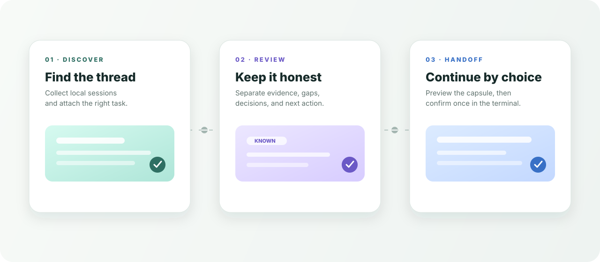
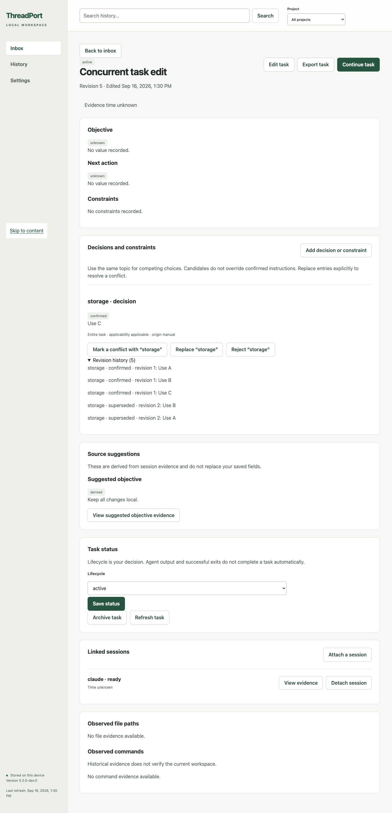

<p align="center">
  
</p>

<p align="center">
  <a href="https://github.com/Frankie-Xu/threadport/actions/workflows/ci.yml"></a>
  
  <a href="LICENSE"></a>
</p>

<p align="center">
  <a href="#quick-start">Try it</a> ·
  <a href="#the-workflow">See the workflow</a> ·
  <a href="docs/v0.2/README.md">Read the docs</a> ·
  <a href="CONTRIBUTING.md">Contribute</a>
</p>

<h1 align="center">ThreadPort</h1>

<p align="center">
  <strong>Pick up where the coding agent stopped.</strong><br />
  Find unfinished work, review what is known, and prepare a deliberate continuation — locally.
</p>

## The workflow

<p align="center">
  
</p>

ThreadPort turns observable session traces into a portable **Context Capsule**. The capsule keeps the objective, decisions, files, commands, tests, Git state, evidence, and next action together so a person can review the context before another agent continues.

## Why it exists

| When work is… | ThreadPort makes it… |
| --- | --- |
| scattered across terminals and tools | searchable in one local workbench |
| easy to overstate after the fact | explicit about evidence, gaps, and uncertainty |
| risky to resume automatically | previewed first and confirmed again in the terminal |

## Quick start

Requires Node `>=24`.

```bash
npm ci
npm run build
node dist/src/cli.js ui --no-open
```

Open the loopback URL printed in your terminal, choose a local workspace and source directory, then:

1. Refresh a source and find a session in **History**.
2. Attach it to a task and review the evidence.
3. Prepare a continuation, read the transfer text, and confirm in the terminal.

For a clean tour without local logs:

```bash
node dist/src/cli.js ui --demo --no-open
```

## What moves between agents

The [Capsule v1 schema](schema/capsule-v1.schema.json) is the portable boundary:

```text
objective · decisions · constraints · files · commands · tests
git state · evidence · coverage gaps · next action
```

Adapters for Claude, Codex, Cursor, and Gemini map observable local traces onto that shape. A suggested next action is reviewable data; ThreadPort never executes it automatically.

## Built for a careful handoff

- Local by default: source sessions and project contents stay on the device.
- Evidence-aware: missing, stale, or ambiguous records remain visible instead of becoming certainty.
- Consent-based: the complete transfer is previewed before the one-use terminal confirmation.
- Observe-only: locating an installed target does not claim vendor identity, compatibility, or launch support.

<details>
<summary><strong>See the workbench</strong></summary>

The image below is a real local workbench capture. It shows the evidence and decision surfaces; demo data is synthetic and is never presented as continuation proof.

<p align="center">
  
</p>

</details>

## CLI and SDK

After `npm run build`, the artifact CLI can extract, validate, render, and package a handoff:

```bash
node dist/src/cli.js extract --from claude --session ./session.jsonl --project .
node dist/src/cli.js validate /path/printed/by/extract.json
node dist/src/cli.js handoff --to codex /path/to/capsule.json --format json --out ./handoff.json
```

The public adapters share one input shape:

```ts
import { createGeminiAdapter } from "threadport";

const capsule = await createGeminiAdapter().extract({
  sessionPath: "./tests/fixtures/gemini/session-basic.jsonl",
  project: { name: "my-app", root: process.cwd() },
});
```

## Documentation

| Start here | Go deeper |
| --- | --- |
| [Documentation index](docs/v0.2/README.md) | Product scope, architecture, contracts, and quality gates |
| [Local development](docs/LOCAL-DEVELOPMENT.md) | Supported setup and development loop |
| [Compatibility matrix](docs/compatibility.md) | Formats, versions, and certification gaps |
| [Compatibility evidence](docs/compatibility-evidence.md) | Source and adapter boundaries |
| [Security policy](SECURITY.md) | Private vulnerability reporting |
| [Contributing guide](CONTRIBUTING.md) | Branches, checks, and pull requests |

> [!NOTE]
> This is a local development preview. Passing local checks does not certify real cross-agent continuation or a stable release. See the [release boundary](docs/verification/release-0.2.0.md).

## License

ThreadPort is released under the [Apache License 2.0](LICENSE).
