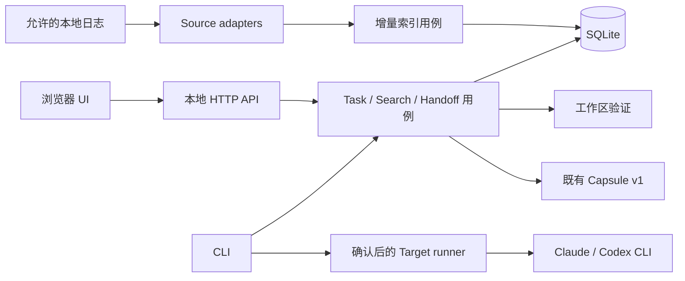

# 架构与技术决策

## 1. 架构形态

采用单仓库、单 npm 包、模块化单体。CLI 和本地 HTTP 服务共享应用用例，UI 只调用 HTTP API。既有 Capsule 库仍可单独 import，不因 import 而打开数据库、启动服务或扫描文件。



不可跨越的依赖规则：domain 不能 import fs、child_process、HTTP、SQLite、React；应用用例通过端口调用基础设施；UI 不 import 服务端模块；source adapter 不启动目标 Agent；runner 不负责从日志猜任务状态。组装依赖仅在 CLI/service composition root。

## 2. ADR-001 · 交付方式与运行时

**决定：** CLI + 本地 Web，Node 24，TypeScript strict、ESM、npm、现有 Zod 3 与 Vitest 保持。新增 React + Vite 作为 UI 构建工具，Fastify 作为本地 API，SQLite + better-sqlite3 作为本地存储。精确依赖版本由 T05/T11 的兼容安装 PR 写入 package-lock，不把浮动 `latest` 用于发布构建。

理由：首版需要 UI、事务、搜索和可靠任务编辑；不需要桌面壳、账户服务或 monorepo。SQLite 降低手工处理多文件更新与恢复的成本。better-sqlite3 带来原生安装成本，必须在 P1 通过目标平台干净安装验证；失败不能拖到发布日才发现。

不选 Electron/Tauri：暂时不需要系统托盘、内嵌终端和系统终端自动化。不选向量数据库：首版可搜索文本即可。不选 ORM：少量 SQL、固定迁移、端口隔离足够。React state + URL 查询参数即可，不先引入全局状态框架。

变化：现包 `engines >=20` 将在 v0.2 明确改为 `>=24.0.0`，同步 `.nvmrc`、CI、README 和迁移文档。旧 v0.1 安装不被追溯改变。主要依赖不在同一个功能 PR 顺手升级 major。

参考核对于 2026-09-14：[Vite 安装要求](https://vite.dev/guide/)、[Fastify 支持政策](https://fastify.dev/docs/latest/Reference/LTS/)、[better-sqlite3 安装和升级说明](https://github.com/WiseLibs/better-sqlite3)。文档说明支持范围，实际组合仍以项目安装矩阵为准。

## 3. ADR-002 · 目录与模块责任

以下为目标目录，文件随所属任务建立，不先造空壳。继续一个 package.json，无 workspace 包拆分。

```text
src/
  index.ts                       # 既有公共 Capsule API；显式导出
  capsule.ts / types.ts           # 冻结 Capsule v1
  markdown.ts / redact.ts         # 既有渲染与脱敏
  git.ts                         # 既有只读 Git 快照入口
  cli.ts                         # 薄路由和 IO；不放业务判断
  adapters/                      # 既有手动 extract API，保持兼容
    common.ts / claude.ts / codex.ts / cursor.ts / gemini.ts / types.ts
  domain/
    models.ts                    # Task/Session/Event/Claim 类型
    errors.ts                    # 结构化领域错误
    derive-task.ts               # 纯函数聚合；不访问 IO
    command-state.ts             # 命令逐次结果与最后状态
  sources/
    contracts.ts / registry.ts    # SourceAdapter 端口和内置注册
    claude-source.ts              # Claude 文件发现、版本识别、规范化
    codex-source.ts               # Codex 文件发现、版本识别、规范化
    jsonl-reader.ts               # 完整行游标、容量限制、取消
  indexing/
    service.ts / scheduler.ts     # 幂等批次、刷新、取消
  tasks/
    contracts.ts / service.ts     # 事务用例、revision、人工字段
  search/
    service.ts                    # 查询规范化、过滤与分页
  storage/
    database.ts / migrations.ts   # SQLite 创建、备份、迁移
    sqlite-store.ts               # Store 实现，不泄漏 SQL 到用例
    migrations/001-initial.sql
  workspace/
    paths.ts                     # 平台路径规则、仓库内外身份
    snapshot.ts / verify.ts       # 有范围的快照及匹配报告
  handoff/
    contracts.ts / prepare.ts     # 不可变接续包、长度预算
    export.ts / confirm.ts        # 原子写入、摘要、确认失效
  targets/
    contracts.ts / registry.ts    # 能力矩阵与 runner 端口
    detect.ts / claude.ts / codex.ts
    launch.ts                    # 唯一允许启动目的端的实现
  server/
    app.ts / auth.ts / routes.ts  # loopback、认证、薄 API 映射
    schemas.ts                   # 请求与响应验证
  platform/
    paths.ts / atomic-write.ts    # 应用目录、写入原语
    process.ts                   # execFile/spawn 包装、超时/信号
  diagnostics/service.ts
web/
  index.html / vite.config.ts
  src/
    app.tsx / api.ts / styles.css
    features/onboarding/          # 来源选择与 demo
    features/inbox/               # 任务和未关联会话
    features/task/                # 人工编辑与证据
    features/handoff/             # 预览、漂移、终端命令
    features/settings/            # 来源、清理、诊断
tests/
  domain/ sources/ indexing/ storage/ tasks/ workspace/ handoff/ targets/ server/
  fixtures/{claude,codex,cursor,gemini}/
  fixtures/compatibility/         # 来源版本与已支持字段清单
  integration/                    # 真实 fs/SQLite/fake Agent
  e2e/                            # Playwright 浏览器流程
  helpers/                        # temp repo、fake clock、fake executable
scripts/
  package-smoke.mjs / benchmark.mjs / check-doc-links.mjs
docs/
  v0.2/                          # 本开发规格
  adr/                           # 实施中发生的决策变更
  compatibility.md               # 真实验证版本和降级行为
  verification/                  # 每个 RC 的可复核摘要
```

不要求每个函数一个文件，也不做泛化 `BaseService` 或 `utils.ts` 大集合。超过约 300 行的业务文件应在 review 中解释是否存在可分离职责；行数本身不是机械拒绝理由。单一变更最好只触及一个用例与必要的端口，不以“扩展性”为由创建还没有消费者的层。

## 4. ADR-003 · 存储与数据寿命

默认应用目录：macOS `~/Library/Application Support/ThreadPort`；Linux `${XDG_DATA_HOME:-~/.local/share}/threadport`；Windows `%LOCALAPPDATA%/ThreadPort`。允许显式 `--data-dir`，测试必须注入临时目录，不能读取真实 HOME。目录/文件在 POSIX 用 0700/0600；Windows 验证当前用户目录权限，不声称 chmod 等价 ACL。

SQLite 使用 WAL、foreign_keys=ON、busy_timeout=5000，所有写入短事务。索引每 100 个事件或累计 100 ms 提交一次（先到为准），解析/文件读写在事务外执行；查询必须分页。初版不用 FTS，使用参数化 LIKE/INSTR 搜索规范化小片段，确保中文子串可搜；容量测试不达标再用 ADR 引入适合中文的索引，而不是取消中文验收。

存储三类数据：

1. 人工数据：Task、Revision、SessionLink，默认保留，重建索引不得删除。
2. 可重建索引：Session、脱敏 Event、游标、搜索片段；源目录可重扫。
3. 接续记录：不可变 HandoffPackage、批准摘要和 launch attempt。未执行包 15 分钟后不能启动；文件与批准记录默认 7 天清理，成功/失败诊断摘要保留 30 天，用户可提前清除。预览可重新生成。

不持久化原始日志副本。摘录单事件最多 4 KiB，超限记录 omitted 标记和定位，不影响人工约束全文。数据库含本地路径映射，属于私有数据；导出时删除机器路径并重新脱敏。

`PRAGMA user_version` 单调递增；迁移前用 SQLite backup API 制作一致备份，不复制正在写入的 WAL 文件冒充完整备份。迁移事务失败回滚、保留备份、显示修复路径，不自动删库。旧程序见到更高 user_version 必须拒绝打开。恢复操作停服务后从备份重建；回退会丢失备份之后的编辑，界面须告知。

数据库写入统一经 Store。多个 CLI 进程允许读短事务；同一 handoff 启动权用事务条件更新抢占，仅一个从 prepared 转 launching。异常退出留 interrupted，不自动重试运行 Agent。服务 instance 信息含 PID、端口、随机 instance ID；检测存活不能仅靠旧 PID，避免误杀其他进程。

## 5. ADR-004 · Source 与 Target 分离

SourceAdapter 管「发现/解析」；TargetRunner 管「探测/准备启动」。不要让一个 AgentAdapter 同时处理日志布局、SQL、权限和进程。

新 Agent 的最小贡献范围：注册 source capability、版本化合成 fixture、解析与契约测试、支持声明。只有真实接续验证通过才增加 runner 能力。Cursor/Gemini 的旧 extract 保留；不因 renderer 能生成 Markdown 就获得 launch 标志。

Source 标识为 agent + 来源配置 ID + vendor session ID；缺 vendor ID 时使用 canonical source path 派生 ID 并标为低可移植性。事件 ID 为 session ID + source ordinal + 记录摘要。追加不重编号，重建按相同算法复现；新旧身份冲突必须隔离并提示。

## 6. ADR-005 · 事实、摘要与协议

内部 Task 不是 Capsule。Task 有可编辑 revision，Session 有事件事实；Capsule 是按指定时刻投影得到的兼容输出。内部事实标签和当前验证不必挤进 Capsule v1；新的 `threadport.task-handoff.v1` 包显式携带这些元数据，并嵌入一个合法 Capsule。

保持 `threadport.handoff.v1` 旧格式与 `extract/validate/render/handoff/targets` 旧命令可用。新增命令/格式显式命名，旧 stdout 形状不静默改变。`validate` 文档写明 schema-only；增强验证用新 `verify` 命令。

测试结果必须分开三个时间：源事件发生时间、工作区捕获时间、验证时间。解析过去日志时无法补造测试当时的工作区摘要。无证据就显示 unknown；first release 不用 LLM 推断来填补。

## 7. ADR-006 · 本地服务及目的端执行边界

HTTP 只监听 `127.0.0.1`，操作系统分配端口；校验 Host 为实际监听地址/端口，不启用任意 Origin 的 CORS。服务启动生成 256-bit 随机 token；CLI 在 URL fragment 传入一次，前端读取存到当前页面内存并立即移除 fragment，用 Authorization 请求 API。禁止把 token 放 query、日志、持久化浏览器存储或诊断。

所有 `/api/v1` 路由（包括读取）要求 token；浏览器 POST/PATCH/DELETE 要求匹配 Origin 与 JSON Content-Type，Origin 不匹配或 `null` 拒绝。CLI 无 Origin 请求仍须 bearer token。请求体上限 1 MiB；文件访问只能引用已配置来源/项目和应用生成 ID，不能提供任意读文件 endpoint。静态资源只从构建目录提供，目录穿越拒绝。

UI 把日志当文本渲染，禁用原始 HTML和 javascript URL；Content-Security-Policy 限同源，生产环境不加载外部字体、脚本或统计。开发期 Vite 代理仅用于本地开发，不继承为生产跨域豁免。

浏览器不直接 spawn；终端 `continue` 读取同一个数据目录，检查包摘要、revision、期限与当前工作区，再请求本地终端确认。包里的 command/next_action 永远只是上下文，不转成 executable。runner 的 executable 来源于受控 Agent 映射，argv 经类型校验，`shell:false`；输入方式按具体版本实现。

清楚告知：ThreadPort 的本地索引不上传数据，但接续文本交给目的端后可能由目的端发送给其模型服务。ThreadPort 不控制其权限系统，也不设置绕过确认的选项。

## 8. 旧代码迁移顺序

| 当前路径 | 处理 | 保持的兼容点 |
| --- | --- | --- |
| `src/adapters/common.ts` | 先修 path / failure；再抽纯聚合函数 | 四个 extract 输出仍合法 |
| `src/git.ts` | 保留旧 API，复用快照原语，新 verify 独立 | `readGitState` 导出与旧测试 |
| `src/cli.ts` | 在新用例落地时拆命令 handler | 旧 flag、stdout、默认目录 |
| `src/targets.ts` | 旧导出用兼容 facade；新 runner 独立 | 旧 targets JSON 形状 |
| `src/types.ts` / schema | 不扩 Capsule v1 字段 | 示例与消费者继续解析 |
| `src/index.ts` | 逐项显式导出公共 API | import 无副作用 |
| `tsconfig.json` | 分 core/web/test 构建配置 | declarations 正确，不把测试发布到包 |
| `package.json` / CI | 合入需要依赖的垂直任务 | npm lock、Node 声明、包可安装 |

`suggestedLaunch()` 当前通用 `--prompt-file` 不能继续被新 UI 使用；兼容函数标 deprecated，并只在实际支持时输出已验证建议，不支持应明确失败。公共行为变化要在迁移说明列举、加测试，不默默输出可能执行错误的命令。

## 9. 扩展性审查问题

新增第三个 source 是否只改 registry、新 adapter、fixture 和兼容说明？替换 SQLite 是否只影响 Store 实现和组装入口？同一 Task 用例能否在 CLI/API 共用？一次用户编辑是否保留其 provenance？如果答案是否定，先评审依赖方向，再增加功能。

扩展点是有实际消费者的接口。v0.2 不发布通用插件 ABI、不设计分布式事件总线、不引入依赖注入框架。
